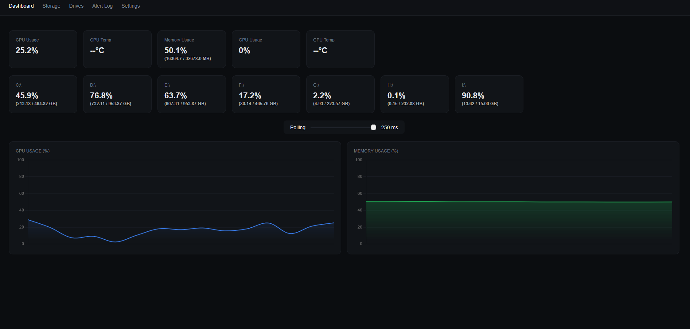
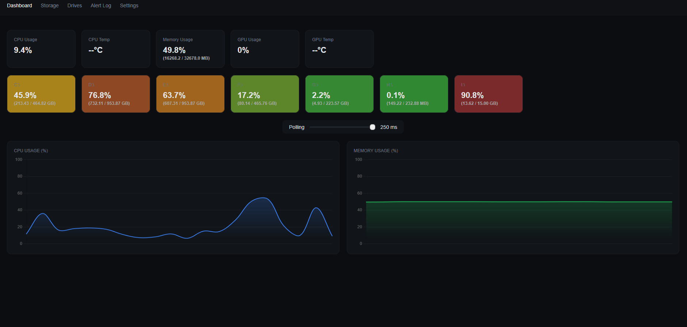

# Flux-Panel

Flux-Panel is a simple, lightweight, easy to deploy server management dashbord
It's designed to be minimal, modern, and easy to use, with all configuration you may need
The whole thing is build in a way where you can easily build you own frontend if you want


<br>


## Features

- Shows basic server stats: CPU, RAM, GPU, Storage
- Live updates with **Flask-SocketIO**
- Lightweight and fast
- Minimal dependencies
- Modern, clean interface

## Getting Started

1. Clone the repository:
```bash
git clone https://github.com/kali4nya/Flux-Panel.git
```

2. Install the required packages:
```bash
pip install -r requirements.txt
```

3. Run the server:
```bash
python main.py
```

4. Open your browser and go to [localhost:5000](http://127.0.0.1:5000)


## Why Flux-Panel?

It’s designed to be quick to set up, easy to use, and visually clean without extra fluff. Perfect if you want a modern server dashboard that works immediately with minimal effort.
